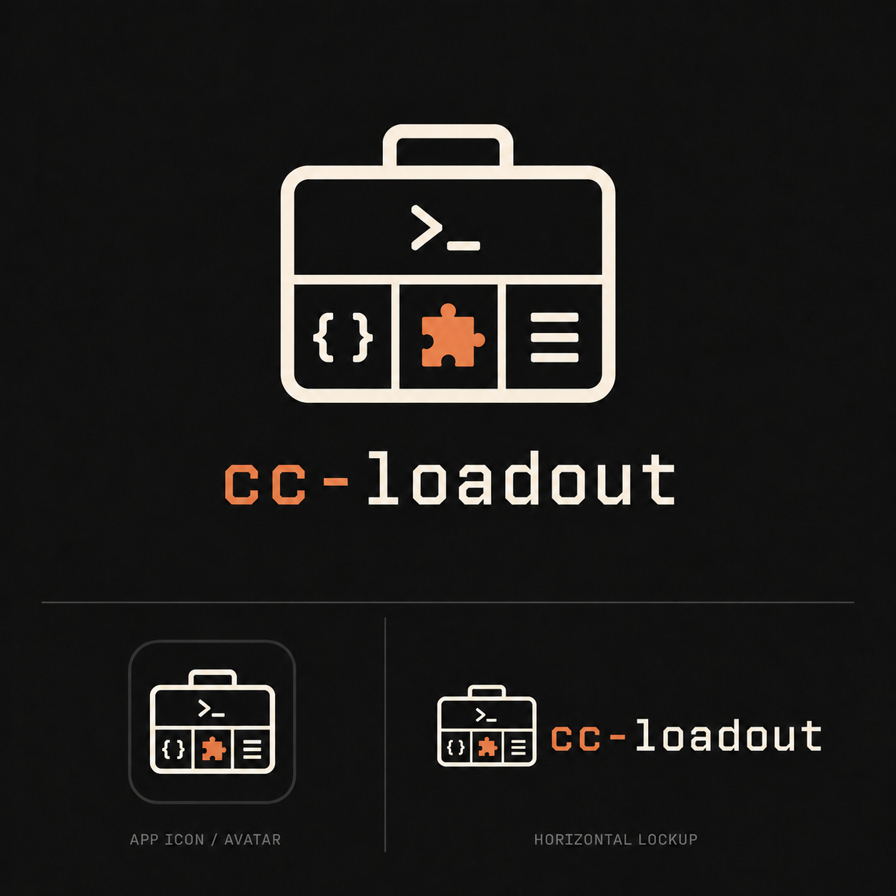

# cc-loadout

<p align="center">
  <a href="https://cc-loadout.pages.dev/">
    
  </a>
</p>

> Claude Code loadout 管理器 —— 在多個 Claude 帳號間切換,並為每個 repo 組好、套上對的 plugin profile。

[](https://github.com/xbluesky/cc-loadout/actions/workflows/ci.yml)
[](LICENSE)
[](CODE_OF_CONDUCT.md)

[English](README.md) | **繁體中文**


`cc-loadout` 是一個小巧的 Rust CLI,管理你 Claude Code 設定中的兩個部分:

- **帳號(Accounts)** —— 把每個 Claude Max / 訂閱帳號的憑證快照下來,一個指令就能切換(例如某個帳號撞到用量上限時)。
- **設定組合(Profiles)** —— 決定每個 repo 需要哪些 plugin,並保持同步。一塊互動式**看板**(`cc-loadout profile init`,或直接執行 `cc-loadout` 切到 Profile 分頁)會掃描你已安裝的 plugin 與你的 repo,讓你把它們歸類到各個 profile —— 也可以讓 Claude 幫你草擬分組 —— 然後寫出你的 `profiles.json`。打開任一 profile,還能直接在看板裡編輯它的**偵測規則**(決定它套用到哪些 repo),邊打邊看命中的 repo 數與差一點命中的提示。接著它會把 profile 專屬的 plugin 在**全域關閉**(保留 universal 的開著),所以一個 repo 預設只載入 universal 那組;`apply` 再把每個 repo 對應的 plugin 在它的 `.claude/settings.local.json` 開回來。結果:每個 repo 都是對的 plugin,而不是到處都載入全部。

## 快速上手(Quickstart)

```bash
# 1. 安裝(從 clone;需要 Rust toolchain)
git clone https://github.com/xbluesky/cc-loadout && cd cc-loadout && ./install.sh

# 2. 先快照你目前登入的帳號 —— 再快照其他帳號
cc-loadout account add work
#    在 Claude Code 裡 /login 另一個帳號,然後:
cc-loadout account add personal

# 3. 某個帳號撞到 5 小時上限時,幾秒內切換
cc-loadout account use personal --launch

# 4. 設定每個 repo 的 plugin profile —— 打開 hub:
cc-loadout
#    → 切到 Profile 分頁。第一次進來會問「✨ Let Claude draft your
#      profiles?」(或自己把 Unassigned 的 plugin 歸類),然後按 w 套用。
#      每個 repo 從此只載入適合它的 plugin。
```

第一次用?Profile 分頁是一塊**看板**:每個 plugin 都歸在 **Universal**(到處都載)、某個 **profile**(只在符合的 repo 載),或 **Unassigned**(未歸類)之下。設定 = 把 Unassigned 桶清空,然後按 `w` 套用。

## 為什麼(Why)

- **用量上限。** 有多個 Claude 訂閱時,其中一個撞到上限不該讓你停工 —— `cc-loadout account use <其他>` 幾秒內就換掉作用中的登入。
- **Plugin 預算。** Claude Code 會把每個啟用 plugin 的 skill 都載進每一個 session,撐爆 skill 說明的預算,還會在不同類型的 repo 裡誤觸 skill。`cc-loadout` 把 profile 專屬的 plugin 在全域停用,只在符合其 profile 的 repo 裡重新啟用,所以一個 session 只載 universal plugin 加上少數適合當前 repo 的那幾個。

## 功能(Features)

- 單一執行檔,無執行期相依。
- `account` —— 快照 / 切換 / 列出真實的 Claude 登入;交易式、原子性的憑證切換,失敗會 rollback,切換後還會驗證。
- `profile inventory` —— 列出你已安裝的 plugin 與各 repo 的訊號(也支援 `--json`,餵給看板與 agent skill)。
- `profile init` / `edit` —— 一塊互動式**看板**(也可以執行 `cc-loadout` 後切到 Profile 分頁進入),透過把已安裝的 plugin 歸類到各 profile 來建出 `profiles.json`,並提供選用的 `✨` AI 草稿(由 Claude 提議分組)和一個會標示飄移(新裝/已移除的 plugin、未命中的 repo、全域飄移)的二次編輯檢視。原子性寫入;會備份既有檔案;並調整全域啟用集,讓非-universal 的 plugin 不再到處載入。`profile init --root <dir> --assign <file>` 則以非互動方式跑同一套設定,供 agent / CI 使用。
- **在看板裡編輯偵測規則** —— 打開某個 profile 的 Detail 檢視 → Rules 分頁,不用手寫 JSON 就能編寫它要命中什麼:四種規則類型(`path under` / `has file` / `has any` / `contains`)、邊打邊更新的命中數與 **near-miss(差一點)** 面板、`?` 解釋某個 repo 為何命中(或不命中)、`f` 從範例 repo 反推規則,以及 `path under` 值的路徑 ghost 補全。
- `profile detect` / `apply` —— 每個 repo 的 plugin 偵測(路徑前綴、marker 檔案、marker glob,以及檔案內容比對 —— 某個檔案含某個字;舊設定的 `package.json` 相依 / 相依關鍵字規則仍會命中),可手動覆寫;universal + profile 的 plugin 集合採疊加;以外科手術式的合併保留你的 on-demand 與無關設定。`--all` 會掃過你 scan root 下的每一個 git repo。
- `doctor` / `doctor --fix` —— 檢查並修復 cc-loadout 自己的安裝狀態:補上缺少的 `profiles.json`、把飄移到 `scope: local` 的受管理 plugin(包含 cc-loadout 自己)提升回 `scope: user`、清掉舊版本留在 `settings.json` 裡的 hook 項目,並回報(加 `--prune-backups` 可刪除)舊版本留下的逾時備份檔。
- 也以 Claude Code plugin 形式發佈:內附的 `/cc-loadout:init` skill 透過跟 Claude 對話幫你建 profile(不需要 TTY);看板裡的 `✨` AI 草稿是 TUI 內的等價做法。

## 安裝(Install)

### 作為 Claude Code plugin(推薦)

cc-loadout 以 Claude Code plugin 形式發佈,內附一個導引式的 profile 建立 skill。先把它加成 marketplace,再安裝:

```
/plugin marketplace add https://github.com/xbluesky/cc-loadout
/plugin install cc-loadout@cc-loadout
```

就這樣——裝上 plugin,CLI 本身也會一併準備好。下次 session 一啟動,它的 launcher 就會
下載釘住的 release 版本、驗證 checksum,再把它連結到 `~/.local/bin/cc-loadout`,所以
`cc-loadout` 指令跟內附的 `/cc-loadout:init` skill 永遠是同一個版本,不會各自為政。記得
確認 `~/.local/bin` 在你的 `PATH` 上,互動式 TUI 才能用這個名字找到它——hook 沒辦法看到
你 shell 的 `PATH`,沒辦法替你主動抓出這件事。

接著執行 `/cc-loadout:init`——或直接叫 Claude「幫我設定 cc-loadout profiles」。互動式的
`cc-loadout profile init` TUI 是不靠 agent 的替代做法。

在這次改動之前就用 `install.sh` 裝過的人:你的執行檔照樣能用,不受影響。plugin 只會在
下次 session 啟動時提醒你一次(一句「standalone install」的訊息),並附上能讓兩邊收斂成
同一個、由 plugin 管理的執行檔的那一句 `doctor --fix` 指令。

### `install.sh`(只要 CLI,不裝 plugin)

```bash
curl -sSL https://raw.githubusercontent.com/xbluesky/cc-loadout/master/install.sh | bash
```

給只想要 CLI、不想裝 plugin 的人用。它會下載一份 release、驗證 checksum,並連結到
`~/.local/bin/cc-loadout`——跟 plugin 的 launcher 維護的是同一套「資料目錄 + symlink」
佈局,所以兩邊最終共用同一個執行檔,不會各自留下一份。接著它會執行
`cc-loadout doctor --fix`:種一份 `~/.claude/profiles/profiles.json`(只在不存在時——你的
修改是安全的)、把受管理的 plugin 提升到 `scope: user`,並清掉很早期版本的 `install.sh`
直接寫進 `~/.claude/settings.json` 的 hook 項目(hook 現在隨 plugin 一起發佈,不再需要
`install.sh` 自己裝)。它是冪等的——拉新版本後重跑即可,或隨時執行 `cc-loadout doctor`
檢查是否飄移。確認 `~/.local/bin` 在你的 `PATH` 上。(想裝到別的地方?用
`INSTALL_DIR=...` 就好——但除非同時設定 `CC_LOADOUT_LINK_DIR`,plugin 自己的 symlink
還是會落在 `~/.local/bin`,於是兩個目錄底下都可能各有一份連結,這無妨,反正兩邊指向
同一個受管理的執行檔。)

### 從原始碼(需要 Rust toolchain)

```bash
git clone https://github.com/xbluesky/cc-loadout ~/code/cc-loadout
cd ~/code/cc-loadout
./install.sh
```

在 clone 裡執行時,`install.sh` 改用 `cargo` 建置,並把一個貨真價實的檔案裝到
`~/.local/bin/cc-loadout`——刻意不放進 plugin 管理的資料目錄:擺在那裡的一份開發用 build,
會跟同版號的正式 release 長得一模一樣,每個 session 都會在你不知情的狀況下,悄悄跑你
還沒 commit 的程式碼。想讓 plugin 改用這份 build,而不是自己下載釘住的 release,就
`export CC_LOADOUT_BIN=~/.local/bin/cc-loadout`。(找不到 toolchain,或建置失敗?會自動
退回上面那套下載佈局。)確認 `~/.local/bin` 在你的 `PATH` 上。

## 用法(Usage)

### 帳號(Accounts)

```bash
cc-loadout account add work                 # 把目前登入的帳號快照成 "work"
# 在 Claude Code 裡 /login 你的另一個帳號,然後:
cc-loadout account add personal
cc-loadout account list                     # '*' 標示作用中的帳號;顯示 email / org / token 狀態
cc-loadout account use work                 # 只換憑證(重啟 Claude / `claude --continue` 才生效)
cc-loadout account use work --launch        # 換完後重新啟動 `claude --continue`
cc-loadout account current
cc-loadout account rm personal
cc-loadout account prime personal           # 現在就錨定 'personal' 的 5 小時視窗(--json 給機器讀)
cc-loadout account schedule                  # 互動式精靈(給人用)
cc-loadout account schedule set personal 06:00 11:00 16:00   # 非互動(給 AI):設定時間
cc-loadout account schedule clear personal   # 清掉某帳號的排程(省略 alias = 全部清掉)
cc-loadout account schedule list --json      # 排程 + next_fire(RFC3339)+ last_primed
cc-loadout account list --json               # 機器可讀的清單(也有:current --json、status --json)
```

> **互動模式(不帶 alias)。** `cc-loadout account`(或不帶 alias 的 `account use`)會開一個切換帳號的選單;不帶 alias 的 `account prime` / `account rm` 也是互動式挑選。帶上明確的 `<alias>` 則是非互動(可腳本化 / 給 agent)的形式。

快照存放在 `~/.local/share/cc-loadout/accounts/<alias>/`(憑證檔是 `0600`)。切換是交易式的:先讀目標、刷新即將切出的快照、原子性寫入新登入(失敗會 rollback),最後驗證作用中的帳號真的變了。

**視窗預熱(Window priming)。** Claude 的 5 小時用量視窗是從帳號的第一個請求開始算,不是看牆上時鐘。`account prime <alias>` 會**以那個帳號**送出一個最小請求(隔離進行,不會打擾作用中的帳號),讓它的視窗在你選的時間點開啟;`account schedule` 把這些時間寫進一個受管理的 `cron` 區塊,替你執行 `account prime`。對目前作用中的帳號預熱是 no-op(那會把作用中 session 的 token 從它底下抽換掉)。cron 是唯一的排程器 —— 沒有 daemon。

**給 agent 的 JSON 輸出。** 讀取類指令支援 `--json`(`account list`/`current`、`account schedule list`、`account prime`,以及頂層的 `status`)。輸出是 stdout 上的單一物件 `{ "schema_version": 1, … }`、exit 0;錯誤則以非零 exit、把人讀的訊息印到 stderr。新的 key 可能在不變動 `schema_version` 的情況下加入,所以使用方應忽略未知的 key。`status --json` 也包含一個 `priming` 區段(每個已排程帳號:`next_fire`、`last_primed`)。

### 設定組合(Profiles)

```bash
# 在一個 git repo 裡:
cc-loadout profile inventory          # 列出已安裝的 plugin + 各 repo 訊號
cc-loadout profile inventory --json   # 同上,機器可讀(給 agent 流程用)
cc-loadout profile inventory --root /path/to/tree   # 只掃一棵樹,而非全部 scan_roots
cc-loadout profile init               # 互動式看板 -> profiles.json(+ 調整全域 plugin 集)
cc-loadout profile init --root <dir> --assign <file|-> --json   # 非互動(agent/CI)—— 見「無介面設定」
cc-loadout profile edit               # 互動式編輯既有的 profiles.json
cc-loadout profile detect            # 哪些 profile 命中 + 產生的 plugin 集
cc-loadout profile apply             # 把 enabledPlugins 寫進 .claude/settings.local.json
cc-loadout profile status            # 目前啟用了什麼
cc-loadout profile detect --json     # 機器可讀:repos[].{matched,plugins,signals[{profile,rule,value}]}
cc-loadout profile apply  --json     # 套用 + 以 JSON 回報 enabledPlugins 的 diff
cc-loadout profile status --json     # 機器可讀:repos[].applied = 已啟用的 plugin key
cc-loadout profile force frontend    # 透過 .claude/profile 把這個 repo 釘到特定 profile

# 掃過 scan_roots 下的每一個 git repo:
cc-loadout profile detect --all
cc-loadout profile apply  --all
cc-loadout profile apply  --all --dry-run   # 只稽核:哪些 repo 還沒同步(完全不寫檔)
```

`apply --all` 只會印出真的有改動的 repo,最後給一行 summary。加上 `--dry-run`
就能在不寫任何檔案的前提下回答「還有哪些 repo 需要套用?」—— 在 scan root
底下 clone 了新 repo 之後特別好用:

```console
$ cc-loadout profile apply --all --dry-run
--- /src/new-repo ---
Profiles: rust
  rust-analyzer-lsp@claude-plugins-official: (unset) -> true

Summary: 1 of 996 repos would change; 24 match no profile.
```

搭配 `--json` 就能把稽核寫成腳本 —— 已經同步的 repo,其 `repos[].changed` 會是空的:

```bash
cc-loadout profile apply --all --dry-run --json \
  | jq -r '.repos[] | select(.changed|length>0) | .repo'
```

### 在 TUI 裡編輯偵測規則

`cc-loadout profile edit`(或執行 `cc-loadout`、切到 **Profile** 分頁、按 `v` 切到 by-profile 檢視,再打開一個 profile)會進到看板。打開某個 profile 會進到它的 **Detail** 檢視;`Tab` 切到 **Rules** 分頁,就能編寫這個 profile 要命中什麼 —— 不用手寫 JSON。四種規則類型涵蓋所有情況:

| 規則 | 何時命中一個 repo |
|---|---|
| `path under` | repo 位於某個資料夾底下(路徑前綴) |
| `has file` | repo 根目錄有一個剛好叫這個名字的檔 |
| `has any` | 有任何檔符合 glob(`*.vue`、`*.rs`) |
| `contains` | 某個指定檔含某個字(例如 `requirements.txt` → `torch`) |

當你在建立規則時,看板會顯示命中 repo 的**即時數量**,以及一個 **near-miss(差一點)** 面板 —— 那些*差一點*命中的 repo,連同能補上它們的那一條規則。Rules 分頁的按鍵:`a` 新增、`e` 編輯、`d` 刪除、`f` 從範例 repo 反推規則、`?` 解釋某個 repo 為何命中(或不命中)。`path under` 的值會提供路徑 ghost 補全 —— 按 `→` 接受。用 `.claude/profile` 自我釘選的 repo 不會出現在預覽裡,因為偵測規則不歸類它們。

### 無介面設定(agent / CI)

`profile init` 預設會開互動式 TUI。加上 `--assign` 就會以非互動、無終端機的方式執行 —— 這是 AI agent 或腳本走的路徑。完整設定分三步:

1. **盤點(Inspect)。** `cc-loadout profile inventory --root <dir> --json` 回報已安裝的 plugin(`plugins[].key`),以及它從掃描中建議的 profile(`suggested_profiles[].name`,每個都帶著它找到的 detect marker)。

2. **指派 + 寫入(Assign + write)。** 把已安裝的 plugin 對應到 `universal`(每個 repo 都載)和那些建議的 profile 名稱上,然後寫出來:

   ```bash
   cat > assignment.json <<'JSON'
   {
     "universal": ["serena@official"],
     "profiles": {
       "rust": ["rust-analyzer@community"],
       "node": ["eslint@community"]
     }
   }
   JSON
   cc-loadout profile init --root <dir> --assign assignment.json --json
   ```

   這會寫出 `profiles.json`(每個 profile 的 detect 規則來自掃描),並調整**全域**啟用集(`~/.claude/settings.json`):universal plugin 保持啟用,其它每個受管理的 plugin 都在那裡停用,於是它不再每個 repo 都載入。輸入會被嚴格驗證:未知的 profile 名稱、未安裝的 plugin key、未知的 JSON 欄位,或空的指派,都會在寫入任何東西之前就中止。`--assign -` 讀 stdin;`--json` 結果包含一個 `next_step` 提醒。

3. **逐 repo 啟用(Activate per repo)。** `cc-loadout profile apply --all` 把每個 repo 對應的 plugin 在它的 `.claude/settings.local.json` 啟用,讓 profile 專屬的 plugin 只在它命中的 repo 裡重新開回來。

整體效果:每個 repo 預設只載 universal plugin,而每個 profile 的 plugin 只出現在命中它的那些 repo 裡。

## 設定檔(Configuration)

Profile 放在 `~/.claude/profiles/profiles.json`(可用 `$CC_LOADOUT_PROFILES` 覆寫路徑)。最簡單的建立方式是 `cc-loadout profile init`(或 `/cc-loadout:init` skill),它會掃描你的 repo 並帶你走過各個選擇。若想改用手寫,從隨附的 `profiles.example.json` 開始。Universal plugin 在每個 repo 都啟用;profile 在上面疊加、可堆疊。透過 `profile init` 寫 `profiles.json` 時,也會調整 `~/.claude/settings.json` 裡的全域啟用集(universal plugin 保持開著,其它受管理的 plugin 在那裡關掉),讓它們不再每個 repo 都載;`apply` 接著在本地把每個 repo 對應的 plugin 開回來。

每個 profile 的 `detect` 區塊支援 `path_prefixes`、`marker_files`、`marker_globs`,以及 `content`(一串 `{ "file": …, "word": … }` 配對 —— 某個檔案含某個字)。這正好對應 Rules 分頁編輯的四種規則類型(`path under` / `has file` / `has any` / `contains`)。舊設定可能還帶著 `package_json_deps` / `deps_keywords`;它們仍會命中,TUI 會以唯讀方式顯示,讓你可以把它們改寫成 `content` 規則。

下面這個範例是**起點,不是推薦** —— 這四個 profile 存在的目的是示範四種偵測規則,而不是因為你需要那些特定的 plugin。把 `scan_roots` 指到你放 repo 的絕對路徑(注意:`~` **不會**被展開 —— 用完整路徑),然後把那些 profile 換成適合你工作的 plugin 分組。引擎對任何 plugin、語言或框架都沒有內建認知;下面每一個名稱都只來自這份 JSON。

| Profile | 加入 | 偵測依據 | 規則類型 |
|---|---|---|---|
| `frontend` | ui-ux-pro-max, impeccable, frontend-design | 任何位置有 `*.vue`,或 `package.json` 含 vue/react/svelte | `marker_globs` + `content` |
| `plugin-dev` | plugin-dev, skill-creator | repo 根目錄有 `.claude-plugin/marketplace.json` 或 `plugin.json` | `marker_files` |
| `ai-side` | rag, prompt-engineering | `requirements.txt` / `pyproject.toml` 含 langchain/openai/anthropic/llamaindex | `content` |
| `work` | *(換成你自己的)* | 位於 `/home/you/work/` 底下的任何 repo | `path_prefixes` |

要覆寫偵測,把 profile 名稱(一行一個)寫進 `.claude/profile`,或執行 `cc-loadout profile force <name>…`。`apply` 只寫 `.claude/settings.local.json`(已 gitignore),並保留它不管理的任何 key。

## 注意事項與限制(Notes & limitations)

- **Linux 優先。** 憑證以檔案讀寫(`~/.claude/.credentials.json` 以及 `~/.claude.json` 的 `oauthAccount` 區塊);會尊重 `$CLAUDE_CONFIG_DIR`。尚未支援 macOS Keychain。
- 這些是 Claude Code 的**內部、未公開**檔案,可能在版本之間變動。切換會驗證結果,寧可大聲失敗,也不會默默把你留在錯的帳號上。
- `account use` 預設只換憑證;加 `--launch` 才會重新啟動 Claude(`claude --continue`)。執行中的 Claude 在啟動時就把登入讀進記憶體,所以不重啟就不會吃到新帳號。

## 開發(Development)

```bash
cargo build
cargo test                                              # unit + integration
cargo clippy --all-targets --all-features -- -D warnings
cargo fmt --check
./tests/run.sh                                          # bash 安裝程式/registry 測試(需要 bash、jq、git)
demo/record.sh                                          # 重新產生 README demo GIF(需要 vhs、ttyd、ffmpeg)
```

CI(`.github/workflows/ci.yml`)會跑同一套檢查。`release.yml` 會以 `.tar.gz` + `.sha256` 發佈四個 target —— `x86_64-unknown-linux-musl`、`aarch64-unknown-linux-musl`(兩者皆為完全靜態)、`x86_64-apple-darwin`、`aarch64-apple-darwin`;版號與 changelog 由 `release-plz` 依 commit type 推導。target 清單與資產格式與 [cc-uplink](https://github.com/xbluesky/cc-uplink) 一致,因此同一套 `uname` → target 映射可以解析兩邊的執行檔。

## 參與貢獻(Contributing)

歡迎貢獻。開發環境設定、檢查 gate 與 pull-request 流程見 [CONTRIBUTING.md](CONTRIBUTING.md)。參與受我們的 [Code of Conduct](CODE_OF_CONDUCT.md) 規範。要回報安全性問題,請依 [SECURITY.md](SECURITY.md) 進行 —— 請不要開公開 issue。

## 授權(License)

[MIT](LICENSE) © XBlueSky
